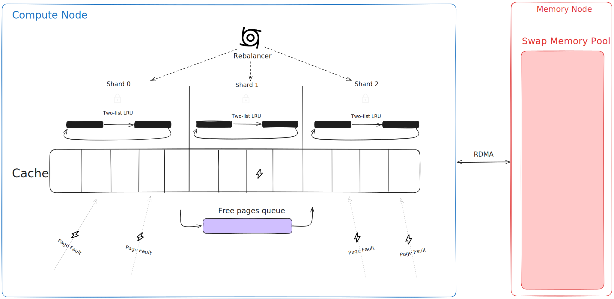
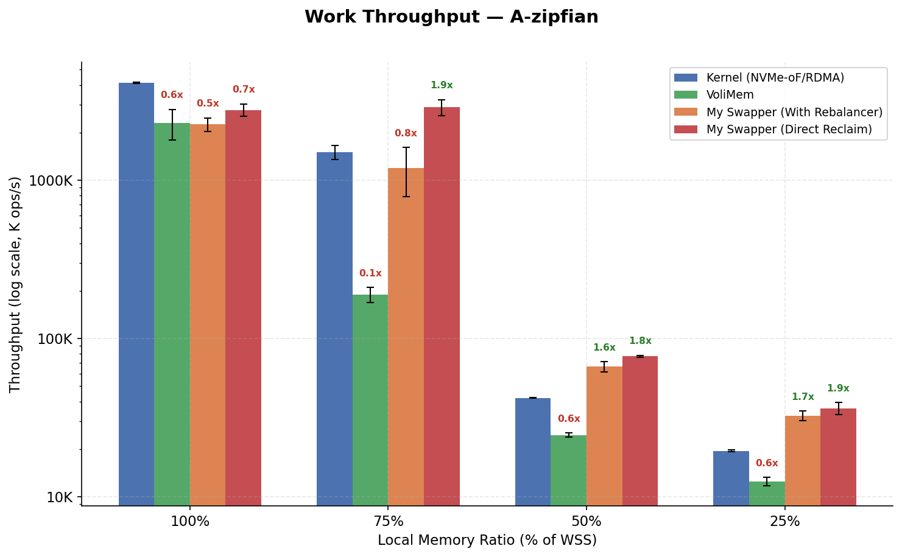

# Lethe

A userspace swapper that runs inside a VM and swaps pages to remote memory over RDMA.

## Building

Requires: C++20 compiler, CMake 3.15+, libibverbs, librdmacm, VoliMem.

```bash
mkdir -p build && cd build
cmake -G Ninja -DCMAKE_BUILD_TYPE=Release ..
ninja
```

Custom VoliMem path:

```bash
cmake -DVOLIMEM_ROOT_DIR=/path/to/volimem ..
```

> **Note:** VoliMem is not publicly available. This repository is
> provided for reference and reproducibility of the research, but
> cannot be built or run without a VoliMem installation.

## Usage

### RDMA server (memory node)

```bash
bin/server
```

### RDMA client (compute node)

```bash
# Defaults: 1 thread, 60M keys, 20M ops, zipfian, workload A, 1850 MB cache
bin/client -a <server-ip>

# Custom run
bin/client -a 10.0.0.2 -k 60000000 -o 20000000 -d zipfian -w A --cache-mb 1850
```

| Flag | Long         | Description                    |
| ---- | ------------ | ------------------------------ |
| `-t` | `--threads`  | Number of threads              |
| `-k` | `--keys`     | Number of keys to load         |
| `-o` | `--ops`      | Number of operations           |
| `-d` | `--dist`     | `uniform` or `zipfian`         |
| `-w` | `--workload` | YCSB workload: `A`/`B`/`C`/`D` |
| `-m` | `--cache-mb` | Cache size in MB               |
| `-c` | `--cache-gb` | Cache size in GB               |
| `-a` | `--addr`     | Server address                 |
| `-p` | `--port`     | Server port                    |

### LD_PRELOAD hook

Inject the swapper into any application:

```bash
LD_PRELOAD=lib/liblethe.so <cmd>
```

## How it works

```
Application (in VM)
     |
     | page fault on heap access
     v
  Swapper (fault handler)
     |
     +-- cache hit? -> map page, resume
     |
     +-- cache full? -> evict via RDMA write,
                         then RDMA read new page
                              |
                              v
                       Remote Memory Node
                       (RDMA swap area)
```

The system has two components:

- **Compute node**: runs the application inside a VoliMem VM. Manages
  a local page cache, intercepts faults, and issues one-sided RDMA
  operations.
- **Memory node**: exposes a region of its DRAM as a remote swap area.
  Only involved during connection setup; all data transfers bypass
  its CPU.

## Why userspace

Kernel-based approaches (Infiniswap, NVMe-oF) pay context-switch
overhead on every page fault and use a general-purpose eviction policy
designed for disk.

Lethe moves the paging stack to user space. It relies on VoliMem for
userland page table manipulation and fast fault interception.
RDMA provides the networking: one-sided READ/WRITE operations access
remote memory without involving the remote CPU.

Design goals:

- **Transparency**: no changes to applications, OS, or hardware
- **Efficiency**: no kernel context switches, no remote CPU involvement

## Page reclamation

Both reclamation architectures use a two-list LRU (active/inactive)
inspired by Linux. The hardware PTE accessed bit drives
promotion/demotion decisions.

### Architecture 1 - Background rebalancer



A background thread periodically scans shards (independently-locked
cache partitions) to demote cold pages, promote hot ones, and
proactively evict when free pages drop below a 20% reserve. Its
frequency adapts via an AIMD scheme based on how many reactive
evictions occur in the fault path.

This architecture is kept on branch `feat/rebalancer` for reference.

### Architecture 2 - Direct reclaim

Replaces the rebalancer with direct reclamation in the fault handler: this mechanism
is heavily inspired by the Linux kernel (which used it before the
multi-gen algorithm introduction).
No background thread, no shards, no locks (single vCPU).

The rebalancer was the first architecture explored. Direct reclaim
came later and consistently outperforms it due to no lock contention.

## Transparency

The swapper currently intercepts faults only within a predefined
virtual address range.

Full transparency (malloc, stack, mmap, ...) is future work. It requires
pinning the swapper's own pages, careful syscall memory layout
handling, and guarding against reclaim recursion deadlocks.

## Evaluation

Tested on two machines with Mellanox ConnectX-3 InfiniBand at 40 Gbps,
direct-cabled. Benchmark: YCSB-like workload A (60M keys, 20M ops,
50/50 read/update) under uniform and Zipfian access.



At 100% local memory no swapping occurs, so the benchmark measures
pure memory access overhead. While the kernel resolves a page fault with ~4
page table walks plus 1 memory load, VoliMem uses nested paging
(SLAT/EPT), which requires up to 24 memory accesses per fault: this
fixed virtualization cost explains why both VoliMem-based systems
(with or without the swapper) are slower than the kernel when no
remote memory is involved.

Outside the no-swap case (100% local memory), my swapper (with direct reclamation)
outperforms the kernel at every pressure level, by up to 1.9x.